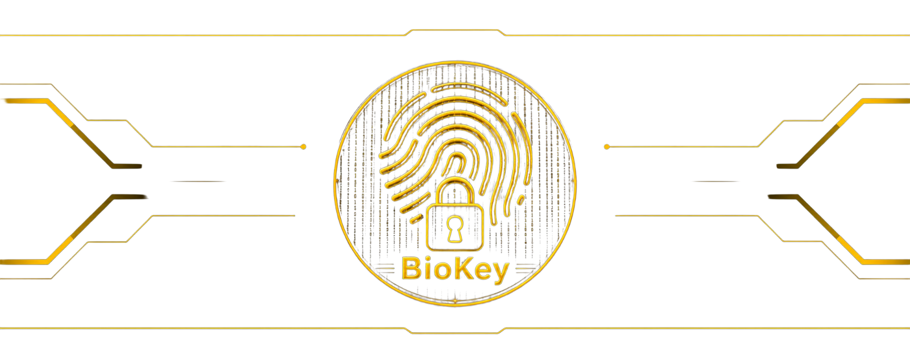
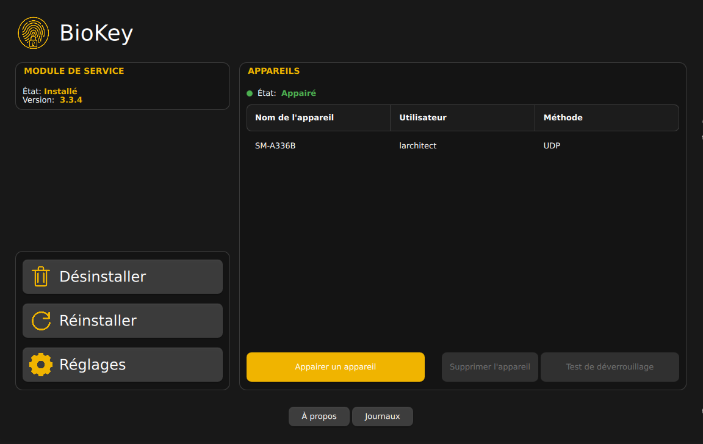

**Déverrouillez votre PC avec votre téléphone.**

[](LICENSE)


<p align="center" style="text-align: center;">
  <a href="README.md"></a>
  <a href="README.fr.md"></a>
</p>

> Ceci est un fork indépendant de [PC Bio Unlock](https://github.com/MeisApps/pcbu-desktop) par MeisApps, sous licence GPLv3. Tout le mérite du protocole original, de l'application desktop et de la conception de la sécurité leur revient — ce fork s'appuie dessus avec les changements décrits dans [Nouveautés de ce fork](#nouveautés-de-ce-fork).

Plutôt que de taper votre mot de passe à l'écran de connexion, à l'écran de verrouillage ou dans une demande de permission, confirmez-le simplement avec votre empreinte digitale ou votre visage sur votre téléphone Android.

Ce dépôt contient l'application desktop. L'application Android compagnon, **BioKey**, a été entièrement réécrite en tant que client indépendant — elle vit dans un dépôt séparé et n'est ni affiliée ni publiée sous la fiche Google Play du projet original.

> [!WARNING]
> Le support macOS est considéré comme expérimental et n'est pas prêt pour les utilisateurs finaux.

<p align="center" style="text-align: center;">
  <a href="https://github.com/L-architec-T/BioKey/releases/latest"></a>
  <a href="https://github.com/L-architec-T/BioKey/releases/latest"></a>
  <a href="https://github.com/L-architec-T/BioKey/releases/latest"></a>
</p>

## Sommaire

- [Nouveautés de ce fork](#nouveautés-de-ce-fork)
- [Fonctionnalités](#fonctionnalités)
- [Capture d'écran](#capture-décran)
- [Installation](#installation)
- [Comment ça marche](#comment-ça-marche)
- [Sécurité et confidentialité](#sécurité-et-confidentialité)
- [Compiler depuis les sources](#compiler-depuis-les-sources)
- [Dépannage](#dépannage)
- [Contribuer](#contribuer)
- [Licence](#licence)
- [Liens](#liens)

## Nouveautés de ce fork

- **Double réveil UDP + FCM** — en plus de la diffusion UDP locale existante, les demandes de réveil peuvent désormais aussi être relayées via Firebase Cloud Messaging, afin que l'invite de déverrouillage atteigne quand même le téléphone quand l'économie d'énergie Wi-Fi fait silencieusement tomber les paquets UDP entrants. Les deux canaux portent le même identifiant de réveil, ce qui permet au téléphone de dédupliquer les deux plutôt que de deviner à partir d'une fenêtre de temps.
- **Démon `pcbu-lockd` (Linux)** — un nouveau service en arrière-plan qui dialogue avec AccountsService via D-Bus pour sélectionner automatiquement la bonne tuile utilisateur à l'écran de connexion/verrouillage GDM, afin que la conversation PAM du compte appairé démarre réellement sans clic physique préalable.
- **Macros et commandes à distance** — les téléphones appairés peuvent déclencher des macros clavier personnalisées sur le PC, avec une correspondance de touches adaptée à la disposition clavier (y compris l'AZERTY français), ainsi que des commandes de verrouillage et de mise en veille à distance, via un nouveau canal de commande léger.
- **Localisation française** — l'application desktop est désormais entièrement traduite en français (`fr_FR`), en plus des langues existantes.
- **Client Android réécrit** — l'application téléphone compagnon a été entièrement réécrite et rebaptisée **BioKey**.
- Icônes de l'application actualisées et divers ajustements d'interface sur l'application desktop.

## Fonctionnalités

- Déverrouillez votre PC avec votre téléphone Android
- Fonctionne via Wi-Fi, réseau local ou Bluetooth. Aucun compte ni connexion internet requis
- Trouve votre PC automatiquement, rien à configurer
- Appairez en scannant un QR code, ou en entrant un code d'appairage à la main
- Appairez plusieurs téléphones, et des téléphones différents pour des comptes utilisateurs différents
- Réveillez votre PC avec Wake-on-LAN avant de le déverrouiller
- Windows et Linux sur x64 et ARM, plus macOS\* sur Apple Silicon

### Où ça fonctionne

| | Fonctionne avec |
|---|---|
| **Windows** | Écran de connexion et de verrouillage, invites UAC |
| **Linux** | Écran de connexion et de verrouillage (GDM, SDDM, LightDM, KDE, Cinnamon, Hyprlock), `sudo` et `polkit` |
| **macOS**\* | `sudo` et invites de permission système \*expérimental |


## Capture d'écran



## Installation

Téléchargez la dernière version pour votre système depuis la [page des releases](https://github.com/L-architec-T/BioKey/releases), puis suivez le [guide d'installation](https://meis-apps.com/pc-bio-unlock/how-to-install), qui détaille les prérequis système, la configuration et l'appairage.

## Comment ça marche

Quand votre PC a besoin de votre mot de passe, il le demande à votre téléphone appairé via votre réseau local ou le Bluetooth. Vous confirmez avec votre empreinte ou votre visage, et le téléphone renvoie la clé qui permet à votre PC de se déverrouiller lui-même. Tout ce que les deux appareils échangent est chiffré, de sorte que seuls eux peuvent le lire.

Lors de l'appairage, vous choisissez comment les deux appareils communiquent entre eux.

**Automatique** signifie que votre téléphone affiche l'invite de déverrouillage tout seul dès que votre PC le demande. Vous pouvez choisir la connexion utilisée :

- **UDP** *(recommandé)* : fonctionne sur n'importe quel réseau local, et continue de fonctionner même si l'adresse IP de votre téléphone change.
- **TCP** : un peu plus rapide, mais fonctionne mieux avec une IP statique pour votre téléphone.
- **Bluetooth** : aucun réseau nécessaire, idéal pour les ordinateurs portables et tablettes en déplacement, au prix d'un peu de batterie.

**Manuel** signifie que rien n'attend en arrière-plan sur votre téléphone. Vous ouvrez simplement l'application et lancez le déverrouillage depuis là, si vous préférez cette approche.

Si quelque chose se passe mal, rien n'est perdu : maintenez <kbd>Ctrl gauche</kbd> + <kbd>Alt gauche</kbd> pour annuler, et connectez-vous avec votre mot de passe comme d'habitude.

## Sécurité et confidentialité

BioKey est conçu pour que son utilisation ne rende pas votre PC plus facile à compromettre.

**Votre mot de passe ne quitte jamais votre PC.** Il est stocké chiffré, et la clé pour le déchiffrer ne vit que sur votre téléphone appairé. Votre téléphone ne voit jamais votre mot de passe, il détient seulement la clé, et le mot de passe n'est jamais envoyé sur le réseau ni à qui que ce soit d'autre. Sans votre téléphone, la copie stockée est illisible, donc quelqu'un qui récupère le fichier sur votre PC n'obtient rien d'exploitable. En plus de cela, le fichier est verrouillé de sorte que seul le système puisse y accéder.

**Rien n'est contourné.** Le déverrouillage se termine par la vérification de votre mot de passe normal par Windows ou PAM, exactement comme si vous l'aviez tapé. Aucune politique de sécurité, restriction de compte ou verrouillage n'est ignoré.

**Tout est chiffré de bout en bout.** L'appairage et le déverrouillage sont protégés par un chiffrement authentifié moderne (AES-256-GCM), avec des clés échangées hors bande via le QR code que vous scannez. Chaque message est signé contre la falsification et porte un horodatage, de sorte qu'un trafic enregistré ne peut pas être rejoué plus tard pour déverrouiller votre PC. Chaque déverrouillage doit également répondre à un challenge à usage unique, rendant une ancienne réponse inutilisable.

**Rien ne sort de votre réseau.** Il n'y a ni compte ni télémétrie. Tout ce que votre PC et votre téléphone se disent est chiffré avec des clés que seuls ces deux appareils détiennent, donc illisible pour quiconque d'autre, y compris nous. Les seules requêtes qui sortent de votre réseau sont la vérification d'une nouvelle version et, si vous décidez d'en installer une, le téléchargement lui-même.

**Votre PC reste fermé.** L'application n'accepte des connexions que pendant l'appairage ou pendant qu'un déverrouillage est réellement en cours, et arrête d'écouter dès que c'est terminé.

**C'est auditable.** Le code source complet de l'application et des composants de connexion se trouve dans ce dépôt, sous licence GPL.

Vous avez trouvé un problème de sécurité ? Merci de le signaler en privé via les [GitHub security advisories](https://github.com/L-architec-T/BioKey/security/advisories) plutôt que par une issue publique.

## Compiler depuis les sources

Il vous faut CMake 3.22+, un compilateur C++23, Qt 6 et OpenSSL 3. Boost, spdlog, nlohmann/json et cpp-httplib sont téléchargés automatiquement lors de la configuration.

<details>
<summary><strong>Windows</strong></summary>
<br>

Visual Studio 2026, le Windows SDK, [Inno Setup](https://jrsoftware.org/isinfo.php) pour l'installeur, et [vcpkg](https://github.com/microsoft/vcpkg) avec `VCPKG_ROOT` défini :

```bash
vcpkg install --overlay-triplets=cmake/vcpkg-triplets --triplet x64-windows-static openssl
vcpkg install --overlay-triplets=cmake/vcpkg-triplets --triplet x64-windows-static-md openssl
```

Pour les builds ARM, utilisez plutôt les triplets `arm64-windows-static` et `arm64-windows-static-md`.

</details>

<details>
<summary><strong>Linux</strong></summary>
<br>

```bash
sudo apt install build-essential pkg-config cmake git \
     libssl-dev libpam-dev libcrypt-dev libbluetooth-dev \
     libgl1-mesa-dev libegl1-mesa-dev libxkbcommon-x11-dev libxcb-cursor-dev
```

</details>

<details>
<summary><strong>macOS</strong></summary>
<br>

Les outils en ligne de commande Xcode et Qt pour macOS.

</details>

### Build

```bash
cmake -B build -DCMAKE_BUILD_TYPE=Debug
cmake --build build
```

Qt est détecté automatiquement ; passez `-DQT_BASE_DIR=<chemin>` pour choisir une installation spécifique.

### Packaging

`pkg/build-desktop.sh` compile et empaquette une release : un exécutable d'installation sur Windows, une AppImage sur Linux, ou une image disque sur macOS. La plateforme, l'architecture et le chemin de Qt sont détectés automatiquement, ou peuvent être définis via les variables d'environnement `PLATFORM`, `ARCH` et `QT_BASE_DIR`.

## Dépannage

Les problèmes de connexion, les soucis d'appairage et comment revenir dans un PC qui ne vous laisse plus entrer sont couverts dans le [guide de dépannage](https://meis-apps.com/pc-bio-unlock/troubleshooting).

Pour tout le reste, l'application intègre deux outils : un visualiseur de logs pour l'application et le composant de connexion, avec un interrupteur de *logs de débogage* dans les réglages, et un test de déverrouillage qui permet d'essayer un appareil appairé sans verrouiller votre écran.

## Contribuer

Les issues et pull requests sont les bienvenues. Quelques indications :

- Le style de code est imposé par les fichiers `.clang-format` et `.clang-tidy` versionnés. Merci de lancer clang-format avant de soumettre.
- **Traductions** : copiez `common/res/en_US.json`, traduisez les valeurs, puis enregistrez le nouveau fichier dans `common/CMakeLists.txt` (`embed_json`), `common/src/utils/I18n.cpp` et `LocaleHelper`.
- **Rapports de bugs** : merci d'utiliser le template d'issue et de joindre les logs desktop et du module ; ce sont eux qui permettent de diagnostiquer les problèmes réseau et PAM.

## Licence

[GNU General Public License v3.0](LICENSE)

## Liens

- Dépôt : [L-architec-T/BioKey](https://github.com/L-architec-T/BioKey)
- Application Android : pas encore publiée — voir le dépôt du client Android BioKey
- Projet original (upstream) : [MeisApps/pcbu-desktop](https://github.com/MeisApps/pcbu-desktop)
